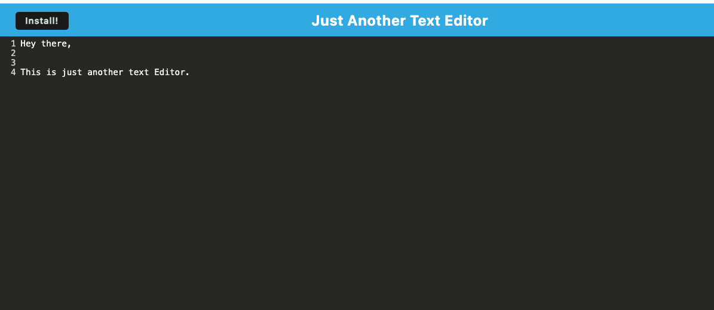

# JAT-just-another-text-editor
 A single page text editor that  meets the PWA criteria and runs in the browser. Additionally, it features a number of data persistence techniques that serve as redundancy in case one of the options is not supported by the browser. The application also functions offline.

## Image of app

## Repo:
https://github.com/fswDevSteph/JAT-just-another-text-editor 

## Upcoming Iterations

N/A

## Contributors

Tutors, AskBC Assistants

## Known Issues:

N/A

## About Developer:

Stephanie Perroni is a full stack software development student with 5+ years of experience as a software tester on various projects who hopes to make meaningful and positively impactful contributions in the software development space.

